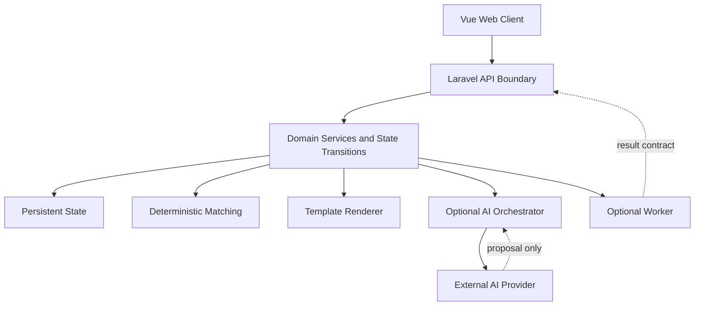
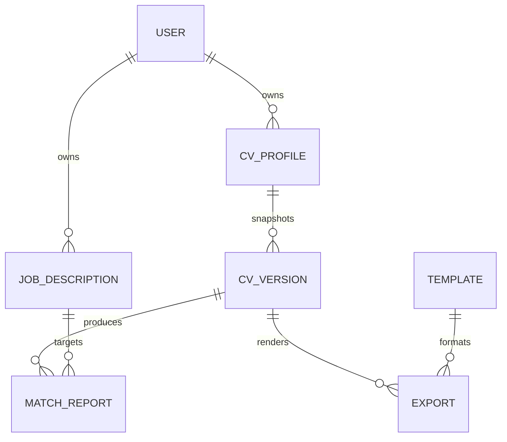

# Architecture Spine — CareerFitCV

## Design Paradigm

Use a layered application with one authoritative domain boundary:

```text
Web presentation (Vue)
        |
        v
Application/API boundary (Laravel controllers, requests, resources)
        |
        v
Domain services and state transitions (Laravel)
        |
        v
Persistence (Laravel models, migrations, JSON contracts)

Optional worker and external providers integrate through explicit application
boundaries and never become alternate owners of trusted product state.
```

## Invariants & Rules

### AD-1 — [ADOPTED][PRESERVE] Structured CV is the canonical representation

- **Binds:** FR-3, FR-4, FR-5, FR-8, FR-9, FR-10, FR-12
- **Prevents:** The editor, matcher, renderer, and later AI features from using incompatible free-form CV representations.
- **Rule:** Store and exchange CV content as a versioned structured document; raw text may be retained only as an input or audit artifact, never as the sole domain representation.

### AD-2 — [ADOPTED][REFINE] Laravel owns trusted product state

- **Binds:** FR-1 through FR-12, NFR-1, NFR-2, NFR-4
- **Prevents:** Vue, AI providers, or the worker independently mutating User-owned resources or bypassing authorization and validation.
- **Rule:** The Laravel API is the sole owner of authentication, ownership checks, validation, persistence, and trusted state transitions. Vue owns interaction state; integrations return data through explicit application contracts.

### AD-3 — [ADOPTED][PRESERVE] CV Profile is mutable; CV Version is immutable

- **Binds:** FR-3, FR-4, FR-5, NFR-2
- **Prevents:** Editing a reusable Profile from silently changing a Version already used for a Match Report, Preview, or Export.
- **Rule:** A CV Profile may be edited as a draft. A saved CV Version is a complete immutable snapshot with a stable identity. Changes that must be preserved create another Version.

### AD-4 — [ADOPTED][REFINE] Downstream results pin their source snapshot

- **Binds:** FR-5, FR-8, FR-10, FR-11, NFR-2, NFR-5
- **Prevents:** A Match Report, Preview, or Export changing meaning after the CV Profile is edited.
- **Rule:** A Match Report identifies the exact CV Version, logical Job
  Description, Job Description revision, and matching-rule version used. A
  Preview and Export identify the exact CV Version, Template, and applicable
  template version used.

### AD-5 — [ADOPTED][REFINE] Deterministic matching is the MVP decision

- **Binds:** FR-7, FR-8, FR-9, NFR-5
- **Prevents:** The first release becoming dependent on an LLM, provider availability, opaque scoring, or non-repeatable output.
- **Rule:** MVP matching uses versioned deterministic normalization, skill vocabulary, evidence classification, and scoring rules. Any later AI explanation is additive and cannot replace the stored deterministic result.

### AD-6 — [ADOPTED][PRESERVE] AI is proposal-only and human-approved

- **Binds:** FR-12 and later AI capabilities, NFR-1, NFR-2
- **Prevents:** Fabricated claims, silent CV mutation, and untraceable provider writes.
- **Rule:** AI providers may inspect permitted inputs and return a validated recommendation or Patch proposal. Only the application can persist it, and a User must explicitly approve a Patch before a new CV Version is created.

### AD-7 — [ADOPTED][PRESERVE] Single controlled orchestrator before multi-agent expansion

- **Binds:** FR-12 and later AI capabilities
- **Prevents:** Divergent agent ownership, routing complexity, and multiple uncoordinated write paths.
- **Rule:** Start with one application-controlled orchestrator and explicit tools/contracts. Introduce multiple agents only after a measured limitation is recorded and the same validation and approval boundaries remain intact.

### AD-8 — [ADOPTED][REFINE] Worker is an optional integration, not a domain owner

- **Binds:** FR-10, FR-11, later asynchronous processing, NFR-4
- **Prevents:** Making the current minimal worker or a future PDF/parser service a mandatory dependency for the MVP or a second source of truth.
- **Rule:** Browser Preview/Export must work without the worker. A worker may perform isolated expensive work through an explicit job/result contract; it may not directly mutate trusted CV, Match Report, or Patch state.

### AD-9 — [SOURCE-CORRECTED][REPLACE] Laravel health path is `/api/health`

- **Binds:** current operational verification and the account-access baseline
- **Prevents:** Health checks and documentation targeting a route that the Laravel source does not expose.
- **Rule:** Treat Laravel `GET /api/health` and framework `GET /up` as the API health surface. Treat worker `GET /health` and `GET /api/health` as worker endpoints; do not conflate the services.

### AD-10 — [ADOPTED][REFINE] MVP export starts at browser print/HTML

- **Binds:** FR-10, FR-11, NFR-2, NFR-4
- **Prevents:** Coupling MVP completion to server-side PDF infrastructure before artifact requirements justify it.
- **Rule:** Render Preview from a saved CV Version and Template, then use the browser print/HTML path for initial Export. Add server-side or worker Export only as a separately justified capability.

### AD-11 — [ADOPTED][REFINE] Job Description revisions preserve report history

- **Binds:** FR-6, FR-7, FR-8, NFR-2, NFR-4, NFR-5
- **Prevents:** Editing or deleting a Job Description from changing the meaning
  of an existing analysis or Match Report.
- **Rule:** A Job Description has a stable `job_description_id` and immutable
  `job_description_revision_id` records. An edit creates a new current
  revision; analysis is pinned to exactly one revision and one
  `analysis_rule_version`, and is not implicitly regenerated. New Match Reports
  may use only the current revision of a non-deleted Job Description, and only
  after that revision has successful analysis. A deleted Job Description is
  logically deleted from new analysis and matching workflows. Its revisions,
  analyses, and historical Match Reports remain readable and reproducible to
  its owner. A Match Report stores the logical Job Description ID, exact
  revision ID, and exact analysis it consumed. The persisted source identifiers
  are `job_description_id`, `job_description_revision_id`, `analysis_id`, and
  `analysis_rule_version`; the Match Report also stores its `cv_version_id` and
  `matching_rule_version`.

### AD-12 — [ADOPTED] Global engineering knowledge has one stable home

- **Binds:** all epics and stories
- **Prevents:** Developers and agents duplicating cross-epic rules in planning artifacts, story files, and ad-hoc implementation notes.
- **Rule:** `docs/architecture/` owns stable system shape and ADR policy; `docs/standards/` owns cross-epic engineering rules; `docs/contracts/` owns stable component agreements; and `docs/domain/` owns shared vocabulary and domain invariants. Epic and story artifacts reference these sources and add only scope-specific behavior.

### AD-13 — [ADOPTED] First-party web authentication uses Sanctum stateful sessions

- **Binds:** FR-1, FR-2, NFR-1, web/API integration
- **Prevents:** Browser bearer-token storage, inconsistent CSRF handling, and client-controlled identity.
- **Rule:** The Vue SPA authenticates to Laravel through Sanctum stateful HttpOnly cookie sessions with CSRF protection. The API explicitly configures allowed stateful origins, credentialed CORS, session-cookie attributes, CSRF bootstrap, logout, and authentication-expiry handling. Protected product endpoints use `auth:sanctum` and server-side ownership policies. Mobile and third-party tokens are deferred.

### AD-14 — [ADOPTED] Product HTTP contracts are versioned and uniform

- **Binds:** all product endpoints, web API client, NFR-3, NFR-4
- **Prevents:** Per-feature response envelopes, framework-error leakage, and non-versioned public API drift.
- **Rule:** Product endpoints live under `/api/v1`. Successful resource responses use `data`; paginated collections additionally use `meta` and `links`. Errors use `code`, `message`, and `details`; validation errors are field-keyed in `details`. `/api/health` is a separate operational payload.

### AD-15 — [ADOPTED] MySQL is the canonical product database

- **Binds:** migrations, persistence, integration tests, deployment planning
- **Prevents:** MySQL, SQLite, and PostgreSQL behaving as unverified interchangeable production dialects.
- **Rule:** MySQL 8.4 is required for shared development, integration/E2E verification, and production. SQLite is limited to local fast unit/scaffold work. PostgreSQL is out of MVP scope. Redis remains optional and cannot be required by the core MVP flow.

### AD-16 — [ADOPTED] New product aggregates have ULID identities

- **Binds:** FR-2 through FR-12, API contracts, persistence, audit records
- **Prevents:** Incompatible public identifier formats and client-created trusted identities.
- **Rule:** Retain existing bigint keys for Laravel users and system tables. Every new product aggregate uses a ULID string as both primary and public API ID; relationships between new aggregates use the same type. Ownership policies, not ID opacity, enforce access control.

### AD-17 — [ADOPTED] Verification is risk-based and environment-aware

- **Binds:** all stories, NFR-1 through NFR-5
- **Prevents:** Critical journeys being accepted from unit tests alone, or E2E resets touching non-disposable data.
- **Rule:** Use PHPUnit for PHP domain/application and Laravel HTTP tests, Vitest for Vue/TypeScript unit and component/composable tests, MySQL 8.4 for integration verification, and Playwright for critical browser journeys. Every story maps acceptance criteria to suitable tests; deterministic behavior uses repeatability fixtures. E2E reset operations require a declared disposable database.

### AD-18 — [ADOPTED] Sensitive content is private by default

- **Binds:** NFR-1, NFR-2, FR-12, worker and provider integrations
- **Prevents:** CV/JD content, credentials, or raw AI exchanges leaking through logs, audit records, or public storage.
- **Rule:** CV data, raw Job Descriptions, authentication material, credentials, and raw AI prompts/outputs do not enter ordinary application logs. Audit records are append-only, sanitized, and reference resources by ULID and actors by their existing User identity. User content and artifacts use private storage by default. Raw AI payload retention is deferred to Epic 5 policy.

### AD-19 — [ADOPTED] Validation is layered, with the server authoritative

- **Binds:** all write contracts, NFR-1, NFR-2, NFR-4
- **Prevents:** Frontend-only validation, HTTP framework checks becoming domain invariants, and integration callers bypassing business rules.
- **Rule:** Laravel Form Requests enforce HTTP shape and boundary constraints. Domain/application code enforces business invariants, ownership, and state transitions for every caller. Frontend schemas improve UX only. Contract changes update documentation, backend validation, frontend schemas, and tests together.

### Dependency direction



## Consistency Conventions

| Concern | Convention |
| --- | --- |
| Naming | Use glossary nouns `User`, `CV Profile`, `CV Version`, `Job Description`, `Match Report`, `Template`, `Preview`, `Export`, and `Patch`; keep API resource identifiers explicit. |
| IDs and sources | Use stable resource IDs; pin derived records to source CV Version and Job Description revision; include schema/rule/template versions where interpretation can change. |
| Data formats | Use validated structured JSON for CV and variable analysis; keep raw inputs separate from derived interpretation; use the documented JSON error envelope. |
| State mutation | Mutate drafts explicitly; create immutable CV Versions and Job Description revisions; apply later Patch approval transactionally; reject stale source values. |
| Ownership | Resolve authorization from authenticated User ownership, not from a client-supplied User ID; every child resource must be ownership-aware. |
| Integration boundary | Providers and workers return DTO/result data through application contracts; they cannot call persistence or become trusted-state owners. |
| Failure behavior | Analysis and Export failures are explicit and retryable where safe; partial trusted state is not silently committed. |
| MVP boundary | Implement account access, structured CV, deterministic matching, Template Preview, and browser Export first; keep AI Patch, provider, worker PDF, and multi-agent work later. |
| Global documentation | Stable cross-epic rules live in `docs/`; planning artifacts and stories reference, rather than duplicate, them. |
| Authentication | First-party web requests use Sanctum stateful cookie sessions and CSRF; ownership is always server-enforced. |
| HTTP contracts | Product API is `/api/v1`, successful payloads are enveloped, and errors are machine-readable. |
| Data platform | MySQL 8.4 is canonical; new product aggregates use ULID strings; all timestamps use UTC ISO-8601 at API boundaries. |
| Sensitive data | Logs omit CV/JD, credentials, cookies, and raw AI data; audits use sanitized metadata and private storage is the default. |
| Verification | Tests map to ACs and critical journeys have browser coverage against disposable data. |

## Stack

| Name | Version |
| --- | --- |
| PHP | `^8.3` application constraint; current Docker image PHP 8.4 |
| Laravel Framework | `^13.17` |
| Vue | `^3.5.40` |
| Vite | `^8.1.5` |
| Pinia | `^4.0.2` |
| Vue Router | `^5.2.0` |
| TypeScript | `~6.0.0` |
| Python worker runtime | `>=3.11` |
| MySQL Docker service | `8.4` |
| Redis Docker service | `7-alpine`, optional for MVP application behavior |

## Structural Seed

### Repository boundaries

```text
CareerFitCV/
├── apps/web/       # Vue presentation and interaction state
├── apps/api/       # Laravel API, domain services, trusted persistence
├── apps/worker/    # Minimal optional worker integration
├── docs/           # Conceptual architecture and implementation packages
└── _bmad-output/   # Generated planning artifacts and architecture spine
```

### MVP data ownership



The diagram is a relationship seed. Field-level JSON shape belongs to the
canonical PRD and implementation packages; ownership and snapshot identity are
architecture invariants.

### Environment topology

```text
Development:
  Browser -> apps/web dev server -> apps/api Laravel runtime
                                  -> local SQLite or apps/api Docker MySQL
                                  -> optional apps/api Docker Redis
  apps/worker -> independent health service on its own port

MVP production shape:
  Browser -> deployed web surface -> Laravel API -> database/storage
                                      \-> optional queue/worker integration
```

## Capability → Architecture Map

| Capability / Area | Lives in | Governed by |
| --- | --- | --- |
| FR-1 Account access | Laravel auth boundary + Vue auth experience | AD-2, ownership convention |
| FR-2 Ownership isolation | Laravel policies/application boundary | AD-2, ownership convention |
| FR-3 CV Profile | Laravel domain/persistence + Vue editor | AD-1, AD-2, AD-3 |
| FR-4/FR-5 CV Version/source integrity | Laravel version service and persisted snapshots | AD-3, AD-4 |
| FR-6/FR-7 Job Description | Laravel intake/analysis services + Vue input | AD-2, AD-4, AD-5 |
| FR-8/FR-9 Match Report | Laravel deterministic matching service + Vue report | AD-4, AD-5 |
| FR-10/FR-11 Preview and Export | Vue renderer initially; Laravel/worker only for later server Export | AD-4, AD-8, AD-10 |
| FR-12 AI Patch | Later Laravel orchestrator/provider boundary and Patch service | AD-2, AD-6, AD-7 |
| NFR-1/NFR-2 Safety and traceability | Laravel authorization, validation, persistence, audit boundary | AD-2, AD-3, AD-4, AD-6 |

## Deferred

- Account recovery policy remains open until account-access implementation
  begins; browser authentication is fixed by AD-13.
- Production database/storage topology and retention policy remain open; local
  SQLite and API-local Docker MySQL are both current repository options.
- Exact CV JSON field limits, aliases, matching weights, and quality thresholds
  belong to the CV and matching capability contracts and evaluation fixtures.
- Template representation and final visual/print direction remain open until
  Preview/Export design work; the architecture only requires a renderer
  consuming a saved CV Version.
- Server-side/worker PDF generation remains deferred until browser Export fails
  an approved artifact requirement.
- AI provider, prompt versioning, tool-call logging, retention, and deletion
  controls remain deferred to the post-MVP AI/hardening work.
- Multi-agent decomposition remains deferred until a measured single-orchestrator
  limitation is recorded.
- The compatibility files at `docs/*.md` route existing links to the canonical
  global documentation tree; they do not define a second source of truth.
