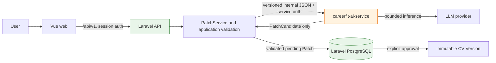
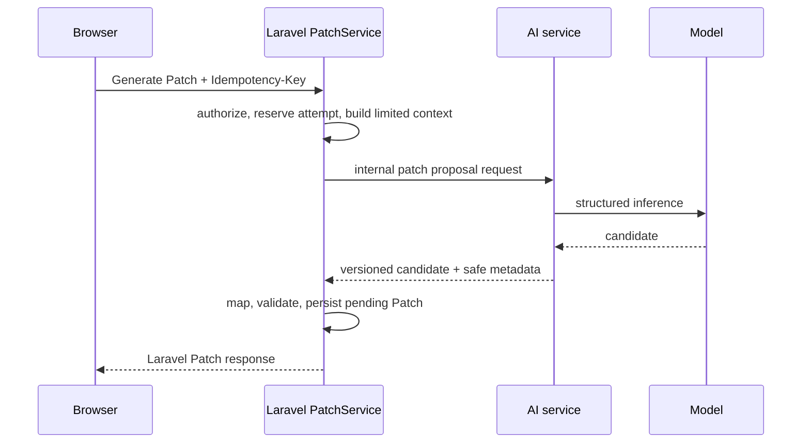

# AI Service Implementation Blueprint

**Status:** proposed build blueprint; no real LLM/provider traffic is enabled
by this document.

**Updated:** 2026-10-09

**Audience:** engineers implementing the post-MVP AI revision capability.
**Canonical planning inputs:** Epic 4 and Epic 5 packages in
`_bmad-output/planning-artifacts/epics/`; implementation lifecycle remains in
`_bmad-output/implementation-artifacts/sprint-status.yaml`.

**Implementation companions:** [Patch Proposal Contract v1](../contracts/ai/patch-proposal-v1.md)
and [AI Service Foundation Delivery Plan](ai-service-foundation-delivery.md).

## 1. Purpose and decision

Evolve `apps/worker` into the runtime service named `careerfit-ai-service`.
It performs bounded inference and returns an untrusted, versioned result to
Laravel over an internal HTTP boundary. Laravel remains the sole owner of
authentication, authorization, source selection, validation, persistence,
Patch approval, and CV Version creation.

This ratifies the existing architecture rather than replacing it:

- `apps/worker` is currently a Python 3.11+ health-service skeleton exposing
  `GET /health` and `GET /api/health`; it has no AI dependencies or business
  persistence.
- Laravel currently binds `PatchProposalProvider` to
  `DeterministicFakePatchProposalProvider` in
  `apps/api/app/Providers/AppServiceProvider.php`.
- `PatchService` already owns idempotency, Evidence/context construction,
  provider-attempt recording, proposal validation, pending-Patch persistence,
  audit, and approval into an immutable CV Version.
- Matching remains deterministic in Laravel. Python does not score or replace
  `MatchEvaluator` in this plan.

The initial delivery is deliberately **not** an agent platform: no DeepAgents,
multi-agent routing, RAG, Python access to Laravel tables, or autonomous state
mutation. LangGraph is deferred until a measured stateful adaptive-interview
workflow needs durable pause/resume.

## 2. Invariants

| ID | Rule |
| --- | --- |
| AI-01 | The browser calls only Laravel `/api/v1`; it never calls an internal AI endpoint. |
| AI-02 | Laravel/PostgreSQL own all trusted business state. The AI service has no Laravel database credentials and cannot create, approve, apply, or edit a Patch/CV Version. |
| AI-03 | Laravel sends a minimum, server-built context DTO. Its JSON Schema is closed (`additionalProperties: false`) with per-field/count/byte limits and a capability egress allowlist. Never serialize Eloquent models, User objects, cookies, credentials, or unrelated CV/JD content into the AI request. |
| AI-04 | AI output is a `PatchCandidate`, not a trusted Patch. Laravel independently validates schema, target allowlist, source snapshot, Evidence references, grounding, and business invariants before persistence. |
| AI-05 | The model must not provide values that Laravel can deterministically derive: `old_value`, source/collection hashes, target ownership, or Patch/CV IDs. |
| AI-06 | Every request/result contract and prompt/tool schema is versioned. Provider/model/prompt/schema metadata is sanitized and recorded with the attempt/result. |
| AI-07 | Raw CV, JD, Evidence, prompts, outputs, authorization headers, secrets, and stack traces do not enter ordinary logs, metrics, traces, browser errors, or audit records. |
| AI-08 | Real provider output is fail-closed: malformed, unsupported, stale, ungrounded, or unavailable output creates no trusted Patch. |
| AI-09 | Retry and idempotency are explicit. A queue or worker cannot create duplicate trusted results or overwrite a terminal execution. |
| AI-10 | A user explicitly approves a validated pending Patch before Laravel atomically creates a new immutable CV Version. |

These rules inherit the repository-wide provider/worker, security, reliability,
and async-job rules in `docs/architecture/overview.md`,
`docs/standards/security.md`, `docs/standards/reliability.md`, and
`docs/contracts/common/async-job.md`.

## 3. Target boundary



`apps/worker` is an execution boundary, not a second domain application. Its
responsibility is HTTP boundary validation, internal authentication,
configuration, prompt/model invocation, structured-output parsing, candidate
validation, and sanitized operational events. Laravel retains domain meaning
and all transitions.

### Planned worker layout

```text
apps/worker/
  app/
    api/              # health, readiness, internal v1 routers
    core/             # settings, auth, errors, request IDs, safe telemetry
    schemas/          # Pydantic transport schemas only
    capabilities/
      patch/          # candidate generation and grounding assessment
      analysis/       # deferred JD/evidence semantics
      interview/      # deferred adaptive interview capability
    llm/              # model factory, profiles, prompts, structured output
    workflows/        # deferred LangGraph graphs only
  tests/
    unit/ contract/ integration/
```

Do not create the deferred folders merely to reserve them. Add a capability
only with its owning contract, tests, and implementation task.

## 4. Contract: Laravel to AI service

The first internal capability is:

```text
POST /internal/v1/patch-proposals
Authorization: internal service credential
X-Correlation-ID: <opaque request ID>
Content-Type: application/json
```

The endpoint is private-network-only in deployment and still requires service
authentication. It accepts only Laravel's short-lived, audience-bound service
identity (mTLS or a signed token with key ID, rotation, revocation, expiry, and
replay protection), not a static shared bearer token. It must enforce a bounded
body size, JSON content type, request timeout, and a correlation ID. Proxies,
APM, HTTP clients, and provider SDKs must redact request headers/bodies by
default. Production OpenAPI/docs UI for this internal service should be
disabled or network-restricted.

### Request v1

Laravel constructs this DTO after ownership, Interview state, source Version,
and positive Evidence checks. IDs below are opaque existing Laravel IDs, not
model objects.

```json
{
  "contract_version": "1.0",
  "execution_id": "<laravel-generated-id>",
  "request_hash": "sha256:<canonical-request-hash>",
  "source": {
    "cv_version_id": "<id>",
    "snapshot_hash": "sha256:<hex>"
  },
  "context": {
    "source_fragments": {
      "summary": "..."
    },
    "positive_evidence": [
      {
        "id": "<evidence-id>",
        "area_signal_id": "docker",
        "answer": "..."
      }
    ]
  },
  "constraints": {
    "target_allowlist": [
      "summary",
      "experience.highlights",
      "projects.highlights"
    ],
    "locale": "en"
  }
}
```

The v1 service accepts only the approved target set. A model instruction, even
one inside CV/JD/Evidence text, cannot expand it.

`source_fragments` is target-scoped, not a dump of the CV. A summary candidate
receives `summary`; a highlight candidate receives only its target item ID,
current highlight, and explicitly approved local context. The contract fixes
closed object shapes, allowed nested fields, string/count/byte limits, and a
capability-specific field-classification/egress allowlist. Laravel rejects
unexpected fields before the request leaves its process.

### Response v1

```json
{
  "contract_version": "1.0",
  "execution_id": "<same-id>",
  "request_hash": "sha256:<same-canonical-request-hash>",
  "source": {
    "cv_version_id": "<same-cv-version-id>",
    "snapshot_hash": "sha256:<same-hex>"
  },
  "status": "succeeded",
  "candidate": {
    "target": {
      "section": "summary",
      "field": "summary",
      "item_id": null,
      "operation": "replace"
    },
    "proposed_text": "...",
    "reason": "...",
    "evidence_source_ids": ["<evidence-id>"]
  },
  "metadata": {
    "provider": "<configured-provider>",
    "model": "<configured-model>",
    "prompt_version": "patch-v1",
    "input_tokens": 0,
    "output_tokens": 0,
    "latency_ms": 0
  }
}
```

Laravel accepts a response only when `execution_id`, `request_hash`, source IDs,
and source hash exactly match its reserved immutable input. `PatchCandidate`
intentionally omits `old_value`. A Laravel
`PatchCandidateMapper` resolves the permitted target against the locked CV
snapshot, obtains exact `old_value` (and collection hash where needed), checks
the item belongs to the version, and only then builds the existing full
proposal consumed by `PatchService::validateProposal()`.

The shared source of truth must be framework-neutral JSON Schema fixtures under
`docs/contracts/ai/` (or another approved single contract package selected at
implementation). Laravel request/response DTOs and Pydantic models are
generated or tested against the same schema; neither replaces it. Version
`1.0` is additive-only until an explicitly versioned breaking contract exists.
Negative fixtures cover extra/nested fields, limit violations, cross-execution
and replayed response binding, and sensitive-content canaries.

### Error mapping

| AI service result | Laravel public behavior | Trusted state |
| --- | --- | --- |
| 401/403 internal auth failure | `PATCH_PROVIDER_UNAVAILABLE` | none |
| transport/timeout/5xx | retryable provider failure | none |
| malformed or wrong-version response | `PATCH_PROPOSAL_INVALID` / validation failure | sanitized attempt only |
| unsupported target, stale source, missing/negative Evidence | validation failure | none |
| supported candidate | pending Patch only after Laravel validation | one pending Patch |

Public error envelopes remain Laravel-owned. Do not proxy Python exception
details, provider payloads, or stack traces to the web client.

## 5. Laravel integration seam

Keep `PatchProposalProvider` as the seam. The change is configuration-driven:

```text
PatchProposalProvider
  ├── DeterministicFakePatchProposalProvider  (default/test-safe)
  └── RemotePatchProposalProvider             (explicitly enabled)
       └── AiServiceClient
            └── POST /internal/v1/patch-proposals
```

`RemotePatchProposalProvider` has no approval, Version, persistence, or
authorization logic. `AiServiceClient` owns service credentials, HTTP timeout,
correlation propagation, transport/error normalization, and response-shape
validation. `PatchCandidateMapper` owns only mapping from a valid candidate to
the existing proposal format; it must not weaken `PatchService` validation.

The current `PatchService` performs the provider call outside its reservation
transaction, has a 15-second synchronous deadline, records
`PatchProviderAttempt`, and enforces `ProviderRetryPolicy` as a retry-admission
/rate window, not an automatic retry loop. Its current values are source
behavior, not the future remote-provider contract. Therefore a remote mock
proves transport integration only. Before enabling a real provider, its
provider/model metadata must replace the current hard-coded
`deterministic_fake` provenance, and every current Patch approval regression
must still pass.

Suggested configuration names (examples only; secrets never committed):

```dotenv
AI_PATCH_PROVIDER=fake|remote
AI_SERVICE_URL=http://ai-service:8001
AI_SERVICE_TIMEOUT_SECONDS=10
AI_SERVICE_TOKEN=<secret-manager-reference>
```

The Python service keeps provider keys in its own runtime configuration. It
does not receive browser credentials or expose provider keys to Laravel/web.

## 6. Execution modes

### 6.1 Initial synchronous mode

Use synchronous remote **mock** first, then a bounded real provider only after
grounding and launch gates pass. The existing endpoint
`POST /api/v1/evidence-interviews/{interview}/patches` remains Laravel-owned.
No queue is added merely because an AI service exists.



### 6.2 Conditional asynchronous mode

Async is a separate, later decision. It is justified only by measured latency,
reliability, or availability evidence and an approved named operation. Until
then, follow the existing Epic 4/Epic 5 decision to keep generation
synchronous.

When approved, Laravel owns an `ai_executions` aggregate and queue job. The
queue requests inference from Python; Python never calls back to create a Patch
or writes business tables.

```text
queued -> running -> succeeded
                  -> retryable_failed -> queued
                  -> terminal_failed | cancelled
```

An async design must pin owner, operation, source IDs/hashes, request hash,
idempotency key, correlation ID, contract/prompt/model versions, attempt/lease
generation (fencing token), result reference, and terminal reason. Timeout is a
failure category/outcome that leads to an approved retryable or terminal state;
it is not a second terminal state. A `PatchProviderAttempt` remains
provider-attempt history linked to the execution; it is not a competing
execution state machine.

Required safety properties:

- same idempotency key + same request returns the same execution; same key +
  different request is rejected;
- every queue payload and result carries `execution_id`, request/source hashes,
  and the incrementing lease generation; Laravel accepts it only when all match
  the currently claimed running lease, and cancellation becomes terminal before
  result acceptance;
- a stable `logical_operation_id`, row lock/CAS, database uniqueness, and one
  completion transaction (`insert Patch` + terminalize execution/attempt +
  idempotency result) prevent duplicate pending Patches; a duplicate-key path
  becomes replay rather than a second Patch;
- source snapshot is fresh at result acceptance;
- model calls are outside database transactions;
- retry budgets distinguish queue delivery, provider retry, and a new
  user-initiated regeneration;
- expiry/recovery transitions prevent indefinite `running` state; and
- no execution may create more than one pending Patch for its logical
  operation.

## 7. Real-model and grounding gate

Use FastAPI/Pydantic settings, Uvicorn, HTTPX, and pytest for the service
foundation. FastAPI documents `pydantic-settings` for environment-backed
settings, including typed validation; its OpenAPI configuration can be disabled
per environment. Pin compatible versions in the lock/dependency resolution at
implementation time rather than copying transient versions into this plan.

For real inference, use a provider adapter behind a model factory. LangChain is
allowed for prompt/model integration and structured output, but is not the
policy engine. Pydantic validation is necessary but insufficient: Python checks
candidate shape and local bounds; Laravel repeats authoritative target, Evidence,
snapshot, ownership, and business validation.

Grounding is mandatory before production provider traffic:

1. Candidate claims are assessed only against supplied positive Evidence.
2. Unsupported, contradictory, fabricated numeric, or out-of-allowlist claims
   fail closed.
3. Laravel rejects the entire candidate on a failed/ambiguous assessment; it
   must not silently splice remaining text into a Patch without revalidating the
   whole result.
4. User edits are revalidated by the same final Patch policy before approval.
5. Synthetic adversarial fixtures cover prompt injection, fabricated skills,
   wrong Evidence IDs, stale source, malformed JSON, and cross-user IDs.

LangGraph is deferred to adaptive interviews with real conditional routing,
durable checkpoints, and human pause/resume. Its checkpoint state is not
Laravel's business state; only a Laravel-validated result can affect it.

## 8. Delivery sequence and acceptance gates

| Increment | Scope | Depends on | Exit evidence |
| --- | --- | --- | --- |
| AI-PR-01 | Convert worker skeleton to FastAPI service; retain both health paths; add `/ready`, typed settings, internal auth, body limit, correlation middleware, Docker/test foundation. No LLM. | none | health/readiness, 401/422, test-client coverage, existing worker checks |
| AI-PR-02 | Publish v1 JSON schemas/fixtures and Pydantic boundary models for PatchCandidate. | AI-PR-01 | positive/negative contract compatibility tests in Laravel and Python |
| AI-PR-03 | Add Laravel client, remote provider adapter, candidate mapper, config switch, Python mock. | AI-PR-02 | fake and remote modes; timeout/malformed cases create no Patch; Patch approval regressions |
| AI-PR-04 | Add real provider adapter, LangChain structured output, model profiles, safe metadata. | AI-PR-02; provider/privacy approval | mock-model tests; no key/log leak; normalized failures |
| AI-PR-05 | Implement bounded Patch generation. | AI-PR-03, AI-PR-04 | allowed target/citation only; Laravel creates pending Patch from valid candidate |
| AI-PR-06 | Add claim grounding and adversarial quality gate. | AI-PR-05 | zero accepted unsupported synthetic claims; edit revalidation |
| AI-PR-07 | Add async lifecycle only after a measurement ADR approves it. | AI-PR-03, AI-PR-06, named operation | duplicate/crash/late-result/recovery tests |
| AI-PR-08a | Add synchronous deployment controls, safe telemetry, concurrency/cost limits, and operational runbooks. | AI-PR-03; real-provider launch gate where applicable | private routing, health/readiness, safe event canaries, incident/recovery evidence |
| AI-PR-08b | Add async-specific operational controls after a named async operation is approved. | AI-PR-07 | queue/execution alerting, recovery/runbook evidence, and safe async telemetry |
| AI-PR-09+ | JD semantics, semantic Evidence assessment, then adaptive LangGraph interview. | real-provider and operational gates | capability-specific contracts/evaluations |

AI-PR-01 through AI-PR-03 are a proposed new implementation increment:
Laravel -> remote mock -> Laravel validation -> one pending Patch. They are not
the existing Epic 4 baseline, which still binds the deterministic fake provider.
They must not bundle real-model quality work. Real provider enablement
additionally requires the Epic 5 provider,
retention, audit, quality, rollout, and kill-switch decisions.

## 9. Verification matrix

| Layer | Required assertions |
| --- | --- |
| Worker unit | settings, service auth, body bounds, error sanitization, candidate schema, prompt constraints, model adapter normalization |
| Contract | valid, missing, extra/nested, wrong-version, invalid ID, unsupported target, size limit, malformed response, cross-execution/replayed binding, and metadata fixtures shared across services |
| Laravel feature/PostgreSQL | ownership, source freshness, candidate mapping, idempotency, logical-operation uniqueness, retry classification, no Patch on timeout/invalid output, and atomic completion/approval |
| Security/privacy | no direct public AI route; expired, wrong-audience, replayed, or revoked service identity rejected; secret/content canaries absent from logs/audit/metrics/errors; no browser-accessible provider key |
| Integration | remote mock success; connection loss; timeout; 429/5xx; duplicate/replayed request; correlation propagation; safe proxy/APM/provider-SDK capture |
| Real-model evaluation | pinned synthetic corpus, groundedness/usefulness/factuality thresholds, adversarial inputs, provider/model/prompt version capture, explicit human launch decision |
| Async, if approved | queued/running/terminal transitions, lease expiry, crash/retry, duplicate delivery, cancellation, stale/late result, one logical Patch |
| Browser | evidence interview -> generate -> review/edit/reject/approve journey, accessible failure/polling states, no internal endpoint call |

PostgreSQL verification is required for persistence, locking, and concurrency
claims. SQLite or a mock proves neither PostgreSQL compatibility nor production
provider readiness.

## 10. Explicit non-goals and open approvals

Not in scope for the first implementation: PDF/OCR worker split, RAG/vector
store, DeepAgents/multi-agent routing, automatic application submission,
automatic Patch approval, direct provider database access, Celery/another
queue, and replacing deterministic matching with LLM scoring.

Before real user traffic, record an accountable approval for:

1. provider/model/region, data fields, subprocessor terms, training/retention,
   deletion, cost budget, and secret rotation;
2. exact prompt, contract, model, and evaluation versions plus quality and
   refusal thresholds;
3. rate/concurrency/timeout/retry/circuit policy and a rollback/kill switch;
4. raw-payload retention policy (default is no ordinary logging); and
5. if async: the measured trigger, queue backend, execution ownership, lease,
   cancellation, retry, and result-acceptance rules.

## 11. External technology checks

The following documentation was checked on 2026-10-09 only to validate fit;
this is not a provider selection or dependency lock:

- [FastAPI settings](https://fastapi.tiangolo.com/advanced/settings/) documents
  typed environment configuration through `pydantic-settings`.
- [FastAPI conditional OpenAPI](https://fastapi.tiangolo.com/how-to/conditional-openapi/)
  documents disabling the OpenAPI endpoint by configuration for restricted
  internal deployments.
- [LangChain structured output example](https://docs.langchain.com/oss/python/integrations/chat/amazon_nova/)
  shows Pydantic/JSON-schema structured output at the provider adapter layer.
- [LangGraph workflow guidance](https://docs.langchain.com/oss/javascript/langgraph/thinking-in-langgraph)
  shows that persistence/checkpointing is needed for pause/resume human-in-the-
  loop flows; adopt the Python equivalent only with the deferred adaptive-
  interview requirement.
